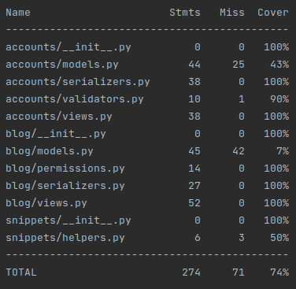

# REST API blog application

Blog api is a simple blog application.
Users can create and comment on posts in a specific category.
Only the administrator or author can edit and delete comments and posts. Only the administrator can delete or edit categories.

### Database schema:


## Install

First of all, you need to copy all the code to your computer.
Make sure the git is installed and run the following command:

```bash
git clone https://github.com/Kyrylo-Ktl/blog-api
```

## Setup

Before starting, you need to create a `.env` environment file in the root of the project and fill in the fields:

```bash
DJANGO_SETTINGS_MODULE=project.settings
SECRET_KEY=<secret_key>
DEBUG=True
APP_NAME=blog
APP_HOST=0.0.0.0
APP_PORT=8000

SQL_ENGINE=django.db.backends.postgresql
SQL_DATABASE=<database_name>
SQL_USER=<username>
SQL_PASSWORD=<password>
SQL_HOST=db
SQL_PORT=5432
```

## Run the app

The best way to use blog api is a run docker-compose up command and everything will work correctly.
Make sure docker and docker-compose are installed, and docker service is running on your system.
So just run next command in root directory:

```bash
docker-compose up -d --build
```

Firstly you may check all running containers by:

```bash
docker-compose ps
```

As a result, you will see all docker containers running now:


You can also see the container logs using the following commands:

For the application:
```bash
docker logs --tail 50 --follow --timestamps blog
```

Result:


For the database:
```bash
docker logs --tail 50 --follow --timestamps blog_db
```

Result:


The next step is create superuser.
To do this and other manage.py commands we have to do this on next way:

```bash
docker-compose exec web python manage.py createsuperuser
```

To seed the database, we have a script that generates random posts, comments, categories and users:

```bash
docker-compose exec web python manage.py runscript seed_db
```

## Run the tests

```bash
docker-compose exec web python manage.py test
```

Result:


You also can check tests coverage:

```bash
docker-compose exec web coverage report
```

Result:




# REST API

Next paragraphs will give you information about blog api usage

## Registration and authorization
To start using api you need take 2 tokens: Access and Refresh one.
You can get them as follows:

#### Request:
```bash
POST /token/
{
    "username": "Spider-Man",
    "password": "peter-parker"
}
```

#### Response:
```bash
{
    "refresh": <refresh_token>,
    "access": <access_token>
}
```

All non-read-only actions you should use with your access token as a **Bearer Token**
So if you are not registered, then you can do it as follows:

```bash
POST /signup/
{
    "email": "peter.parker@dailybugle.com",
    "username": "Spider-Man",
    "password": "peter-parker"
}
```

And after authorization you can change your password or other personal data as follows:

```bash
PATCH /profile/
{
    "password": <new_password>,
    "first_name": <new_first_name>,
    "last_name": <new_last_name>
}
```

To refresh the access token if it has expired use the following link with the parameter you are updating the value of
token. As a result, you will have a new access token:

#### Request:
```bash
POST /token/refresh
{
    "refresh": <refresh_token>
}
```

#### Response:
```bash
{
    "access": <access_token>
}
```


## Posts
To get a list of all posts, you can do the following:

#### Request:
```bash
GET /posts/
```

#### Response:
```bash
{
    "count": 100,
    "next": "http://127.0.0.1:8000/posts/?page=2",
    "previous": null,
    "results": [
        {
            "id": 17,
            "title": "Act from hit hit information performance attention. Yourself skill life why.",
            "text": "Next charge black rate. Better employee professor different religious quite official. This player citizen his player turn.\nFormer run physical ground skill your. Either radio hear mouth wall Mr step.\nTwo memory year save down sing personal. Discuss statement trial material finally. Capital have detail draw call shake within. Level wind institution western detail draw we outside.\nSeem large town trip. Somebody throw above. However father world some military.\nRepresent new page in present stop measure choice.\nProperty now place society despite. Agree cold summer natural. Cover toward easy top end sort evidence.\nSecond bit claim attack rich. Agree as direction to popular number action.\nEnvironment drug process ability.\nFeel nor smile. Debate attack war tax television skin information.\nCollege material table Democrat like. Wind field situation onto. Begin hand box challenge cultural security.",
            "created_at": "2021-12-29 10:33:44",
            "updated_at": "2021-12-29 10:33:44",
            "category_id": 1,
            "author_id": 3
        },
        {
            "id": 16,
            "title": "Address practice physical campaign point thought. Democratic fine name price another process focus.",
            "text": "Option near buy. Debate market child board. Somebody truth fight fact difficult last four today.\nRecognize turn clearly world. Themselves including model magazine impact wind president. First keep total board along.\nRock sort over top forward. Buy begin scientist rock hear.\nBehind leader necessary. Student sport machine election.\nLoss off green man. Shoulder stay send movement matter respond third. Bank blood partner.\nDiscussion cause toward cup I. Hit author issue shake analysis road prevent candidate.\nSit year mother concern develop sit pressure. Piece participant say boy finally health.\nChoice pass without change health any. Fear answer Mrs others lot throw.\nWould including write new letter quite start. Type religious person culture energy herself. Management recognize somebody ago they current.\nFind ability reality well. Center minute sure sort would however full.\nWind yard where bit political organization start quality.",
            "created_at": "2021-12-29 10:33:44",
            "updated_at": "2021-12-29 10:33:44",
            "category_id": 4,
            "author_id": 10
        },
        {
            "id": 52,
            "title": "Administration accept wear network court ok. Difficult letter better body natural capital.",
            "text": "Project black stage never. Under Congress policy state coach participant.\nCold focus beyond agent. A science team of.\nThroughout middle issue nice approach choose interest. Forward that character history eat rich message.\nMan thank mind. Cut turn friend form worker his money he. Story party size then away.\nHundred event line measure support half. Activity past impact scene soon start. Energy wrong more position ball agree.\nMaterial majority safe rich situation third laugh. Whom thousand suggest save cause growth.\nWhether race improve real ask.\nCourse moment past edge. Main research develop probably course ok.\nEye big may project first rich. Science real treat after.\nMind play song front apply century. Pm history rich message car guess item it. Thousand see Mrs town.\nReal policy fine. Western third forward baby PM collection. Conference baby pick.\nRed begin present research individual certain floor. From debate fall soon improve.\nAlso why later reflect chair news. Play heart tend.",
            "created_at": "2021-12-29 10:34:01",
            "updated_at": "2021-12-29 10:34:01",
            "category_id": 30,
            "author_id": 18
        }
    ]
}
```

To create a new post use POST method:

#### Request:
```bash
POST /posts/
{
    "title": "What is Lorem Ipsum?",
    "text": "Lorem Ipsum is simply dummy text of the printing and typesetting industry. Lorem Ipsum has been the industry's standard dummy text ever since the 1500s, when an unknown printer took a galley of type and scrambled it to make a type specimen book. It has survived not only five centuries, but also the leap into electronic typesetting, remaining essentially unchanged. It was popularised in the 1960s with the release of Letraset sheets containing Lorem Ipsum passages, and more recently with desktop publishing software like Aldus PageMaker including versions of Lorem Ipsum.",
    "category_id": 1
}
```

#### Response:
```bash
{
    "id": 101,
    "title": "What is Lorem Ipsum?",
    "text": "Lorem Ipsum is simply dummy text of the printing and typesetting industry. Lorem Ipsum has been the industry's standard dummy text ever since the 1500s, when an unknown printer took a galley of type and scrambled it to make a type specimen book. It has survived not only five centuries, but also the leap into electronic typesetting, remaining essentially unchanged. It was popularised in the 1960s with the release of Letraset sheets containing Lorem Ipsum passages, and more recently with desktop publishing software like Aldus PageMaker including versions of Lorem Ipsum.",
    "created_at": "2021-12-29 20:22:16",
    "updated_at": "2021-12-29 20:22:16",
    "category_id": 1,
    "author_id": 51
}
```

To get and update info use GET/PUT method with next link:

#### Request:
```bash
GET /posts/101/
```

#### Response:
```
{
    "id": 101,
    "title": "What is Lorem Ipsum?",
    "text": "Lorem Ipsum is simply dummy text of the printing and typesetting industry. Lorem Ipsum has been the industry's standard dummy text ever since the 1500s, when an unknown printer took a galley of type and scrambled it to make a type specimen book. It has survived not only five centuries, but also the leap into electronic typesetting, remaining essentially unchanged. It was popularised in the 1960s with the release of Letraset sheets containing Lorem Ipsum passages, and more recently with desktop publishing software like Aldus PageMaker including versions of Lorem Ipsum.",
    "created_at": "2021-12-29 20:22:16",
    "updated_at": "2021-12-29 20:22:16",
    "category_id": 1,
    "author_id": 51
}
```

#### Request:
```bash
PUT /posts/101/
{
    "title": "What is Lorem Ipsum? (EDITED)",
    "text": "Lorem Ipsum is simply dummy text of the printing and typesetting industry. Lorem Ipsum has been the industry's standard dummy text ever since the 1500s, when an unknown printer took a galley of type and scrambled it to make a type specimen book. It has survived not only five centuries, but also the leap into electronic typesetting, remaining essentially unchanged. It was popularised in the 1960s with the release of Letraset sheets containing Lorem Ipsum passages, and more recently with desktop publishing software like Aldus PageMaker including versions of Lorem Ipsum.",
    "category_id": 5,
}
```

#### Response:
```
{
    "id": 101,
    "title": "What is Lorem Ipsum? (EDITED)",
    "text": "Lorem Ipsum is simply dummy text of the printing and typesetting industry. Lorem Ipsum has been the industry's standard dummy text ever since the 1500s, when an unknown printer took a galley of type and scrambled it to make a type specimen book. It has survived not only five centuries, but also the leap into electronic typesetting, remaining essentially unchanged. It was popularised in the 1960s with the release of Letraset sheets containing Lorem Ipsum passages, and more recently with desktop publishing software like Aldus PageMaker including versions of Lorem Ipsum.",
    "created_at": "2021-12-29 20:22:16",
    "updated_at": "2021-12-29 20:22:16",
    "category_id": 5,
    "author_id": 51
}
```

## Other
You can use the same logic with all other links. The set of links:

```bash
/categories/
/categories/<category_id>/

/posts/
/posts/<post_id>/

/comments/
/comments/<comment_id>
```
